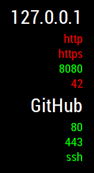

# MMM-portscan
MMM-portscan is a module for the smart mirror platform MagicMirror. It shows you whether specific ports on a set of hosts are open/closed. This way you can check your server status while brushing your teeth.

MagicMirror for RaspberryPi: https://github.com/MichMich/MagicMirror




## Installation

1. Install MagicMirror on your RaspberryPi (if not already installed)
2. Clone this repository in the modules folder of MagicMirror, most probably it will look like this: ~/MagicMirror/modules/MMM-portscan/
3. Add the module to the MM-config, most probably located here: ~/MagicMirror/config/config.js (example entry below)
4. Restart you MagicMirror software

#### Example entry for config.js
```javascript
{
    module: 'MMM-portscan',
    position: 'bottom_right',
    
    config: {
      updateInterval: 60,
      textalign: 'right',
      color_open: '#00ff00',
      color_closed: '#ff0000',

      hosts: [
        {
          name: '192.168.0.1',
          ports: [
            {port: 80},
            {port: 8080},
          ] 
        },
        {
          name: 'github.com',
          ports: [
            {port: 80},
            {port: 22},
            {port: 123},
          ] 
        },
      ]
    }
 }
 ```
 Each machine gets an object containing the hostname or ip and the ports to check.
 Also choose the `position` you want your entries at. Don't forget the commas to separate entries.
 
 #### Possible values for config:
 - updateInterval: in seconds
 - textalign: left, center, right
 - color_open: any hex value (e.g. #ff0000, #b3a2c1), color for open port numbers - leave empty for default color
 - color_closed: any hex value (e.g. #ff0000, #b3a2c1), color for closed port numbers - leave empty for default color
